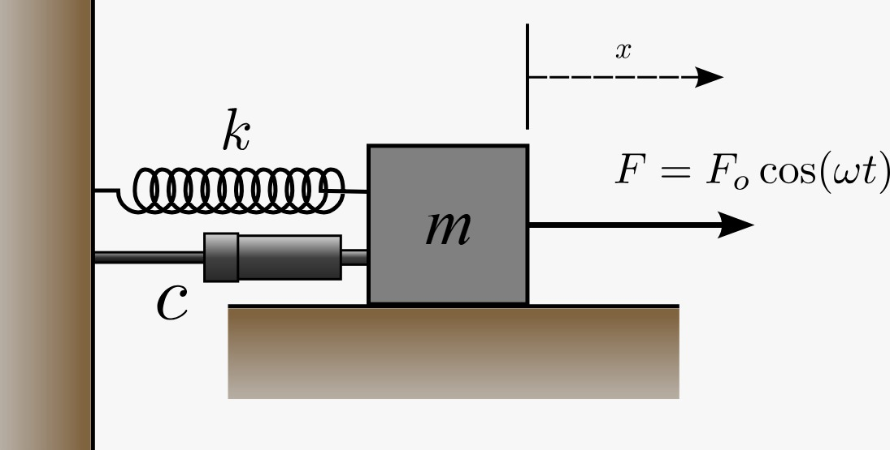
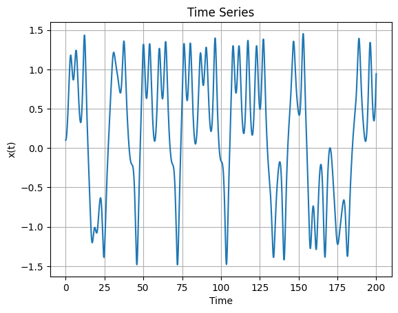
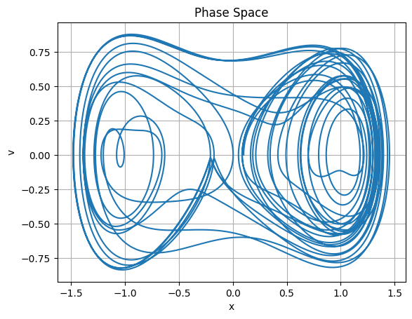
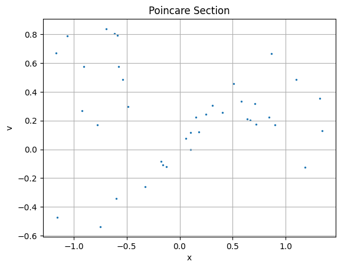
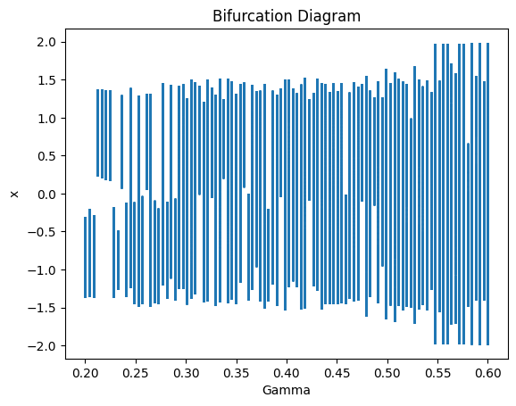
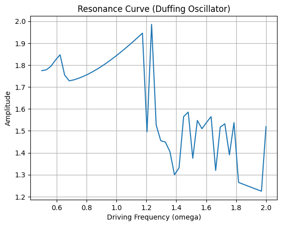

# Duffing_Oscillator
Duffing Oscillator: A Computational Study of Nonlinear Dynamics and Chaos

# Duffing Oscillator Simulation (RK4)

## Overview
This project studies the nonlinear dynamics of the Duffing oscillator using numerical methods.

## Model
The system is governed by:

x'' + δx' + αx + βx³ = γ cos(ωt)

## Method
- Converted to first-order system
- Solved using Runge-Kutta 4 (RK4)
- Simulated over time

### System

## Results

### Time Series

### Phase Space

### Poincare Section

### Bifurcation Diagram

### Resonance Analysis

## Observations
- Periodic motion for small γ
- Transition to complex dynamics
- Chaotic behavior at higher γ

## Skills Demonstrated
- Nonlinear dynamics
- Numerical methods (RK4)
- Python simulation
- Data visualization
